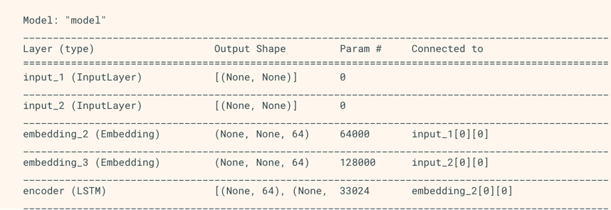

## This document will help to install the necessary libraries to execute the RNN

### Pre-requisites for setting up the tensorflow framework
- Install Anaconda
https://docs.anaconda.com/anaconda/install/windows/

- Install tensorflow through Anaconda
https://docs.anaconda.com/anaconda/user-guide/tasks/tensorflow/

- RNN(Recurrent Neural Network) through Keras
https://www.tensorflow.org/guide/keras/rnn
--------------
### RNN
- Setting up the RNN architecture
```python
import numpy as np
import tensorflow as tf
from tensorflow import keras
from tensorflow.keras import layers
```
- Sequential Layer Modelling
```python
model = keras.Sequential()
# Add an Embedding layer expecting input vocab of size 1000, and
# output embedding dimension of size 64.
model.add(layers.Embedding(input_dim=1000, output_dim=64))

# Add a LSTM layer with 128 internal units.
model.add(layers.LSTM(128))

# Add a Dense layer with 10 units.
model.add(layers.Dense(10))

model.summary()
```
![App Screenshot]

- Output and states
```python
model = keras.Sequential()
model.add(layers.Embedding(input_dim=1000, output_dim=64))

# The output of GRU will be a 3D tensor of shape (batch_size, timesteps, 256)
model.add(layers.GRU(256, return_sequences=True))

# The output of SimpleRNN will be a 2D tensor of shape (batch_size, 128)
model.add(layers.SimpleRNN(128))

model.add(layers.Dense(10))

model.summary()
```
![App Screenshot]


- Initial states and return parameters
```python
encoder_vocab = 1000
decoder_vocab = 2000

encoder_input = layers.Input(shape=(None,))
encoder_embedded = layers.Embedding(input_dim=encoder_vocab, output_dim=64)(
    encoder_input
)

# Return states in addition to output
output, state_h, state_c = layers.LSTM(64, return_state=True, name="encoder")(
    encoder_embedded
)
encoder_state = [state_h, state_c]

decoder_input = layers.Input(shape=(None,))
decoder_embedded = layers.Embedding(input_dim=decoder_vocab, output_dim=64)(
    decoder_input
)

# Pass the 2 states to a new LSTM layer, as initial state
decoder_output = layers.LSTM(64, name="decoder")(
    decoder_embedded, initial_state=encoder_state
)
output = layers.Dense(10)(decoder_output)

model = keras.Model([encoder_input, decoder_input], output)
model.summary()
```
- ![App Screenshot]



- RNN layers and RNN cells
```markdown
keras.layers.SimpleRNNCell corresponds to the SimpleRNN layer.

keras.layers.GRUCell corresponds to the GRU layer.

keras.layers.LSTMCell corresponds to the LSTM layer.
```

- Cross-batch statefulness
1) stateful=True
2) sequence s =[t0,t1,...,t1546,1547]

```python
s1 = [t0, t1, ... t100]
s2 = [t101, ... t201]
...
s16 = [t1501, ... t1547]

```
```python
lstm_layer = layers.LSTM(64, stateful=True)
for s in sub_sequences:
  output = lstm_layer(s)
```
3) Layer reset
```markdown
layer.reset_states()
```

```python
paragraph1 = np.random.random((20, 10, 50)).astype(np.float32)
paragraph2 = np.random.random((20, 10, 50)).astype(np.float32)
paragraph3 = np.random.random((20, 10, 50)).astype(np.float32)

lstm_layer = layers.LSTM(64, stateful=True)
output = lstm_layer(paragraph1)
output = lstm_layer(paragraph2)
output = lstm_layer(paragraph3)

# reset_states() will reset the cached state to the original initial_state.
# If no initial_state was provided, zero-states will be used by default.
lstm_layer.reset_states()
```
- RNN State Reuse
```python
paragraph1 = np.random.random((20, 10, 50)).astype(np.float32)
paragraph2 = np.random.random((20, 10, 50)).astype(np.float32)
paragraph3 = np.random.random((20, 10, 50)).astype(np.float32)

lstm_layer = layers.LSTM(64, stateful=True)
output = lstm_layer(paragraph1)
output = lstm_layer(paragraph2)

existing_state = lstm_layer.states

new_lstm_layer = layers.LSTM(64)
new_output = new_lstm_layer(paragraph3, initial_state=existing_state)
```

- Bidirectional RNNs

```markdown
keras.layers.Bidirectional wrapper
```
```python
model = keras.Sequential()

model.add(
    layers.Bidirectional(layers.LSTM(64, return_sequences=True), input_shape=(5, 10))
)
model.add(layers.Bidirectional(layers.LSTM(32)))
model.add(layers.Dense(10))

model.summary()
```
----------
### Gradient Descent using RNN and Tensorflow
- Include necessary modules and declaration of x and y variables through which we are going to define the gradient descent optimization.
```python
import tensorflow as tf

x = tf.Variable(2, name = 'x', dtype = tf.float32)
log_x = tf.log(x)
log_x_squared = tf.square(log_x)

optimizer = tf.train.GradientDescentOptimizer(0.5)
train = optimizer.minimize(log_x_squared)

```
- Initialize the necessary variables and call the optimizers for defining and calling it with respective function.
```python
init = tf.initialize_all_variables()

def optimize():
   with tf.Session() as session:
      session.run(init)
      print("starting at", "x:", session.run(x), "log(x)^2:", session.run(log_x_squared))
      
      for step in range(10):
         session.run(train)
         print("step", step, "x:", session.run(x), "log(x)^2:", session.run(log_x_squared))
optimize()
```
![App Screenshot]


